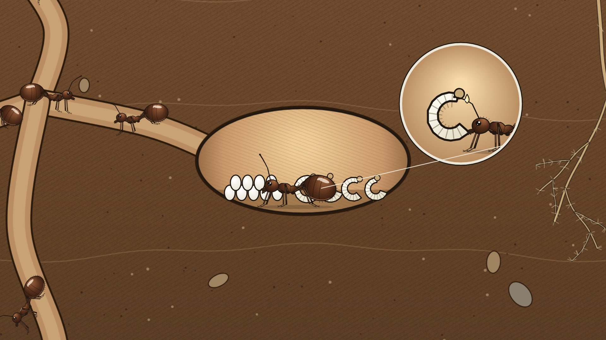
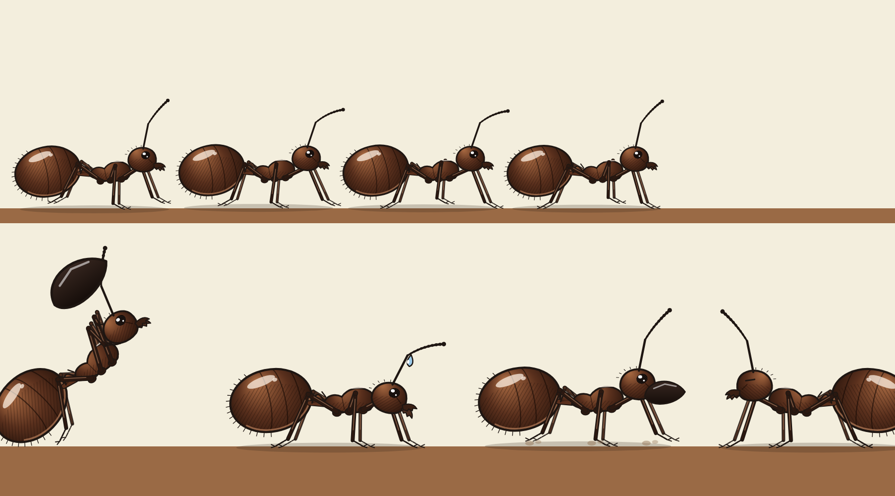
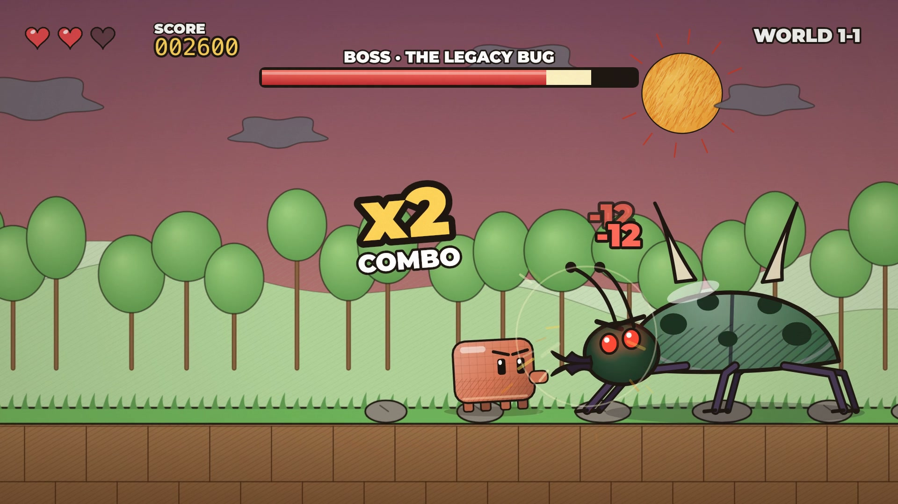
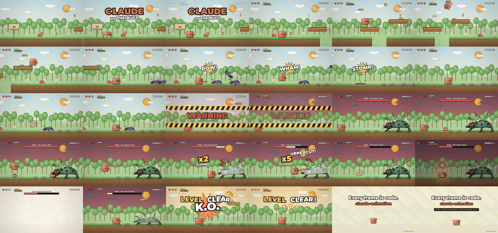
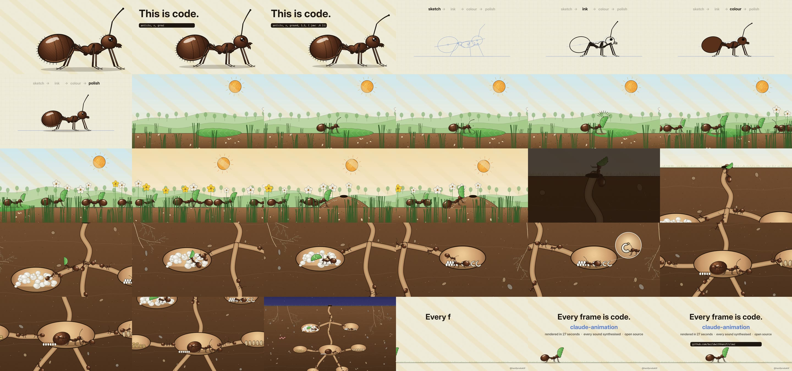

# Claude Animation

**Hand-drawn 2D animation, written as code.** Give it a story and get a frame-exact MP4 that looks drawn:
paper grain, hatching, brush ink, watercolour that blooms, glossy characters with real anatomy, whole worlds
in cross-section, and sound synthesised from the same timeline as the picture.



MIT licensed. Node + ffmpeg. No browser, no GPU, no API keys.

---

## Why this exists

Ask a model to "animate a story in JavaScript" and you get flat shapes sliding around. What makes code look
drawn isn't the model, it's **a vocabulary of detail** and **a habit of looking**. This skill is both,
written down after making the films:

**1. A detail bible.** Every surface gets base → texture → edge. Soil is hatch + strata + pebbles; chitin is a
gradient with form hatch, a specular streak, rim light and setae; leaves have serrated edges and pale veins;
fungus is a spongy mass that grows. Line weight falls off with depth. The skill makes the model ask for
detail surface by surface instead of hoping for it.

**2. Rigs with anatomy.** The ant has a segmented gaster, a petiole node, a humped thorax, a compound eye with
two highlights, toothed mandibles that open, elbowed beaded antennae, and six legs with femur, knee, tibia,
tarsus and claws, walking on a real tripod gait. It can carry, chew, rear up, sweat, blink, be a queen — and
draw itself in layers: sketch, ink, colour, polish.



**3. A colony kit.** Leaves you can cut, leaf pieces to carry, eggs, larvae, cocoons, stores, a fungus garden,
roots, and `nestCanvas()` — chambers and tunnels baked into textured soil, returning paths an ant can walk.

**4. A harness that makes you look.** `sheet`, `strip` (12 consecutive frames around a fast action),
`verify` (a frame must be identical rendered in or out of order), and a staged `render` that never
overwrites a good file with a failed encode.

## The example films

`examples/claude-game/` — 30 s, 16:9 video-game short: an orange block hero runs, jumps and flips across
a textured platform level, punches, kicks and stomps bugs, then fights a boss. Hit-stop on every contact,
screen shake, sparks, comic words, damage numbers, a combo counter, a boss HP bar, a charged special, K.O.,
LEVEL CLEAR. Chiptune soundtrack and 132 sound effects, all synthesised.





### The colony


`examples/ant-colony/` — 32 s, 16:9. "This is code." → the ant built from sketch to polish → a leafcutter
cuts a leaf and carries it through a meadow in a column of others → a dive into the mound → the nest in
cross-section: the leaf goes onto the fungus garden, the nursery, the queen laying, and a pull-back to the
whole colony as day turns to night. 240 sound cues, one music bed, all synthesised. Renders in ~27 s.



```bash
cd plugins/claude-animation/skills/claude-animation && npm install && cd -
cd examples/ant-colony && ./make.sh        # -> out/ant-colony-final.mp4
```

---

## Install

```bash
claude plugin marketplace add buildwithhanif/claude-animation-skill
claude plugin install claude-animation@claude-animation-skill
cd <plugin dir>/skills/claude-animation && npm install
```

Or clone it and point any coding agent at `plugins/claude-animation/skills/claude-animation/SKILL.md`.

**Requirements:** node 20+, ffmpeg/ffprobe.

## Quick start

```bash
SK=plugins/claude-animation/skills/claude-animation
mkdir my-film && cd my-film && cp ../$SK/templates/film-template.mjs film.mjs
CLAUDE_ANIMATION_LIB=../$SK/lib node film.mjs sheet 0,1,2,3,4
CLAUDE_ANIMATION_LIB=../$SK/lib node film.mjs render
node ../$SK/scripts/music.mjs bed.wav --dur 5 --end 4.4
node ../$SK/scripts/sound.mjs cues.json out/template.mp4 out/final.mp4 --bed bed.wav
```

## What's inside

```
plugins/claude-animation/skills/claude-animation/
  SKILL.md                 the rules and the map
  lib/core.mjs             easing, noise, paths, IK, hatch / fibre / grain / burst / speed lines
  lib/pen.mjs              brush, pencil, watercolour, lettering — stable named seeds, opt-in boil
  lib/textures.mjs         paper, light bands, sun, moon, stars, grass, soil, night sky, fruit cells, film finish
  lib/nature.mjs           sprout, melon leaf, tendril, vine, blossom, bee, drop
  lib/colony.mjs           leaf, leaf piece, egg, larva, cocoon, seed, fungus, roots, nest cross-section
  lib/fx.mjs               hit-stop, screen shake, particles, rings, flashes, comic words, damage numbers, afterimages
  lib/rigs/critter.mjs     a blocky action hero (run, jump, flip, punch, kick, hurt, charge)
  lib/rigs/bug.mjs         a beetle enemy and boss
  lib/rigs/ant.mjs         the detailed ant (+ build-up layers and construction guides)
  lib/rigs/bean.mjs        bean-bodied people for the brush-watercolour look
  lib/film.mjs             render / sheet / strip / verify, exposure (ones, twos, holds)
  scripts/sound.mjs        synthesised SFX on a cue timeline + bed + loudnorm + mux
  scripts/music.mjs        an original ukulele bed of any length
  scripts/chiptune.mjs     an original video-game soundtrack with timed sections
  scripts/rig-sheet.mjs    the pose sheet a rig must pass
  templates/               film-template.mjs, beat-sheet.md
  references/              workflow, detail, characters, motion, styles, sound, traps, prior-art
examples/claude-game/      the 30 s video-game short
examples/ant-colony/       the 32 s colony film
```

Ideas from other animation skills are credited in `references/prior-art.md`.
